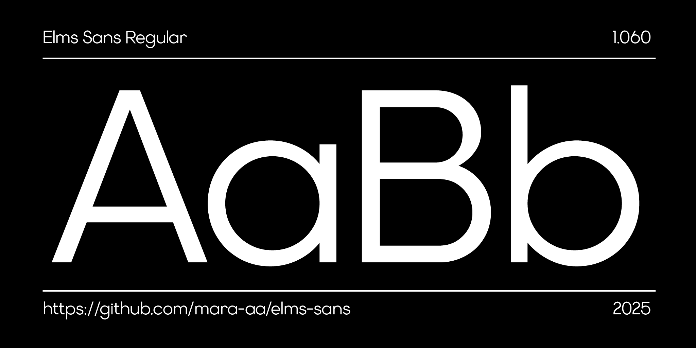
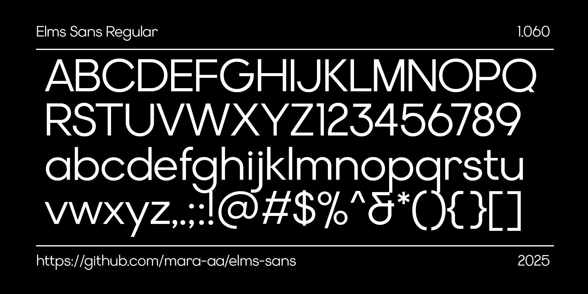

# Elms Sans

[![][Fontbakery]](https://mara-aa.github.io/elms-sans/fontbakery/fontbakery-report.html)
[![][Universal]](https://mara-aa.github.io/elms-sans/fontbakery/fontbakery-report.html)
[![][GF Profile]](https://mara-aa.github.io/elms-sans/fontbakery/fontbakery-report.html)
[![][Shaping]](https://mara-aa.github.io/elms-sans/fontbakery/fontbakery-report.html)

[Fontbakery]: https://img.shields.io/endpoint?url=https%3A%2F%2Fraw.githubusercontent.com%2Fmara-aa%2Felms-sans%2Fgh-pages%2Fbadges%2Foverall.json
[GF Profile]: https://img.shields.io/endpoint?url=https%3A%2F%2Fraw.githubusercontent.com%2Fmara-aa%2Felms-sans%2Fgh-pages%2Fbadges%2FFontFileChecks.json
[Outline Correctness]: https://img.shields.io/endpoint?url=https%3A%2F%2Fraw.githubusercontent.com%2Fmara-aa%2Felms-sans%2Fgh-pages%2Fbadges%2FOutlineChecks.json
[Shaping]: https://img.shields.io/endpoint?url=https%3A%2F%2Fraw.githubusercontent.com%2Fmara-aa%2Felms-sans%2Fgh-pages%2Fbadges%2FShapingChecks.json
[Universal]: https://img.shields.io/endpoint?url=https%3A%2F%2Fraw.githubusercontent.com%2Fmara-aa%2Felms-sans%2Fgh-pages%2Fbadges%2FUniversalProfileChecks.json

Elms Sans is a utilitarian geometric sans serif typeface designed for clarity, consistency, and long-term adaptability. Developed to perform reliably across a wide range of modern applications—from digital interfaces to print environments—it brings a quiet precision to design systems.

The design draws from early geometric models, with particular attention to rhythm, openness, and optical clarity. While maintaining functional neutrality, Elms Sans introduces subtle warmth in its proportions, making it suitable for both display and text use.

Elms Sans includes a single variable axis, `wght` (weight), and spans eight weights: `Thin`, `ExtraLight`, `Light`, `Regular`, `Medium`, `SemiBold`, `Bold`, and `Heavy`, created with 3 masters.

The name Elms is a dedication to three individuals whose mentorship shaped the designer’s career—Elijah Affi, Makua Afiomah, and Solomon Dawudu. It also references the elm tree, often associated with craftsmanship, quiet strength, and resilience—values that guided the design process, both in form and function.

The current version supports Latin-script languages, with additional Sub-Saharan Latin support in development.

## About

Mara is a brand and type designer currently building and leading a strategy-led design studio, Design Teem at TM Global's Nigeria and UK offices.
`https://www.designteem.xyz`

## Building

Fonts are built automatically by GitHub Actions - take a look in the "Actions" tab for the latest build.

If you want to build fonts manually on your own computer:

* `make build` will produce font files.
* `make test` will run [FontBakery](https://github.com/googlefonts/fontbakery)'s quality assurance tests.
* `make proof` will generate HTML proof files.

The proof files and QA tests are also available automatically via GitHub Actions - look at https://mara-aa.github.io/elms-sans/.

## Changelog

When you update your font (new version or new release), please report all notable changes here, with a date.
[Font Versioning](https://github.com/googlefonts/gf-docs/tree/main/Spec#font-versioning) is based on semver. 
Changelog example:

**26 May 2021. Version 2.13**
- MAJOR Font turned to a variable font.
- SIGNIFICANT New Stylistic sets added.

## License

This Font Software is licensed under the SIL Open Font License, Version 1.1.
This license is available with a FAQ at https://openfontlicense.org

## Repository Layout

This font repository structure is inspired by [Unified Font Repository v0.3](https://github.com/unified-font-repository/Unified-Font-Repository), modified for the Google Fonts workflow.
